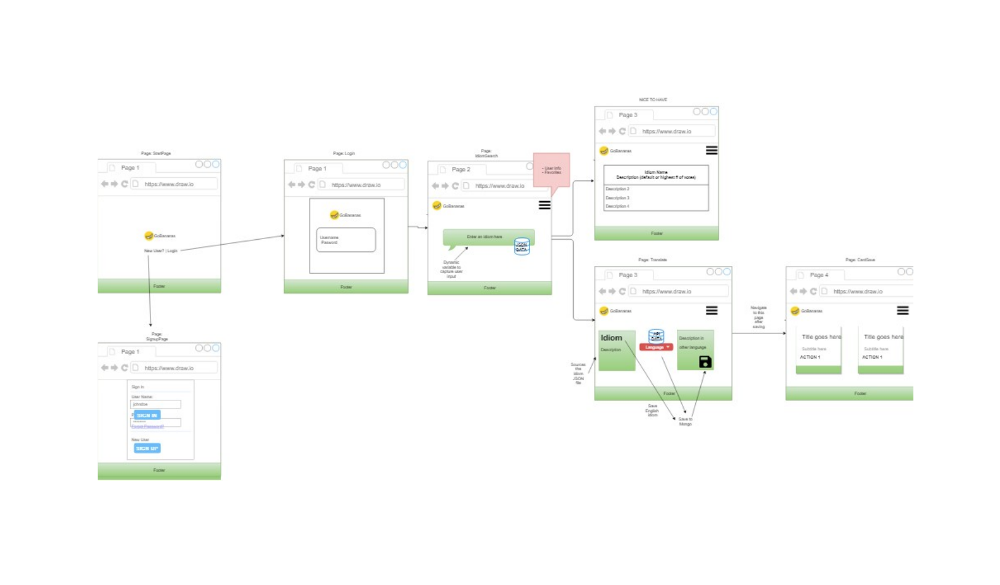

# GoBananas
This is a MERN Stack app in which users can search for English idioms, get explanation and translated it to 65 different languages.
This will help non-English speakers learn idioms, which are very hard to learn.

#### The demo of `GoBananas` application can be found [here](https://gobananas.herokuapp.com) and [here](https://gobananas.azurewebsites.net).

# Team Members

* Hilary Scott
* Maya Huang
* Jennifer Moore

# Roles

* Hilary - Front-end - page functions: translations,language selection menu, etc;
* Maya - Front-end - All UX/UI, idiom search, saved idioms(unfinished);
* Jennifer -Back-end/ - authentication(passport/bcrypt/json webtokens), routes, controllers, mongodb setup, dockerize app, amazon web services.

## Technologies used:
  * Node.js
  * MongoDB
  * Mongoose
  * React.js
  * Javascript
  * AJAX/JSON
  * NPM modules:
    1. express
    2. mongoose
    3. axios
    4. Passport.js - for user login/signup and authentication with JWT
  * Bootstrap
  * CSS
  * HTML5
  * Docker

## APIs
  * Microsoft - Cognitive Services Translator API 

 

